## Haxballers Project Source Code

[Haxballers.ipynb](https://github.com/spicecat/Haxballers/blob/main/Haxballers.ipynb)

## Video Summary

    <iframe loading="lazy" style="position: absolute; width: 100%; height: 100%; top: 0; left: 0; border: none; padding: 0;margin: 0;"
    src="https://www.canva.com/design/DAHEKqW75Ag/h-lBX7447EZg0NOlbvU_iw/watch?embed" allowfullscreen="allowfullscreen" allow="fullscreen">
    </iframe>

[Haxballers Final Report](https://www.canva.com/design/DAHCNPmejgo/NItgT2w0f0EnpV4Lfk27LQ/watch?utm_content=DAHCNPmejgo&utm_campaign=designshare&utm_medium=embeds&utm_source=link)

## Haxballers Presentation

<iframe loading="lazy" src="https://docs.google.com/presentation/d/e/2PACX-1vS1BIdmG4aovJnTXRu9vVug0fBxuTZsfmo2p3hv8w1RogNwIQFAdIGC2vYOvYUikjOyAVFfRGlgWFKz/pubembed?start=false&loop=false&delayms=5000" frameborder="0" width="960" height="569" allowfullscreen="true" mozallowfullscreen="true" webkitallowfullscreen="true"></iframe>

[Haxballers Presentation](https://docs.google.com/presentation/u/0/d/1BxGncV4hh3hDqzrIuOQWIiDDao8WC0f_VLd9kuktl8w/edit)

## Project Summary

Our project aims to develop and train a multi-agent system to play the game of Haxball, a physics-based soccer simulation game. In Haxball, players need to understand its physics in order to control the ball, and they need to make strategic decisions, such as knowing when to move to an open position, when to pass, and when to defend. Because Haxball has a large state space and involves complex decision-making, we decided to use reinforcement learning to train agents.

<iframe width="560" height="315" src="https://www.youtube-nocookie.com/embed/ONGHj6PyU1w?si=Scz40SB-mi4M-FNT" title="YouTube video player" frameborder="0" allow="accelerometer; autoplay; clipboard-write; encrypted-media; gyroscope; picture-in-picture; web-share" referrerpolicy="strict-origin-when-cross-origin" allowfullscreen></iframe>

We want to train agents to score goals, defend goals, and coordinate with teammates. The agents receive the current game state as an input, including the positions and velocities of all players and the ball, and output discrete actions representing cardinal movement directions and a binary kick command. Our training environment will scale from 1v0 drills to 1v1, 2v2, and 3v3 team matches.

Our project is highly non-trivial due to these challenges:

- The multi-agent environment should determine an individual’s contribution to a team reward
- The observation and state spaces should handle differing numbers of players on each team.
- Team coordination, spatial awareness, and dynamic role discovery are extremely complex.

## Approach

We train our agents using Proximal Policy Optimization (PPO) via the `stable-baselines3` library. PPO is a policy gradient method that optimizes a clipped objective function. The loss function is:  
$$L^{CLIP}(\theta) = \hat{\mathbb{E_t}} \left[ \min(r_t(\theta)\hat{A}_t, \text{clip}(r_t(\theta), 1 - \epsilon, 1 + \epsilon)\hat{A}_t) \right]$$
where $r_t(\theta)$ is the probability ratio of the new policy to the old policy, $\hat{A}_t$ is the estimated advantage, and $\epsilon$ is the clipping hyperparameter.

### Environment

We use the `HaxballGym` physics wrapper and convert it to a vectorized, multi-agent environment using `PettingZoo` and `SuperSuit`. We use an MLP policy with a $[256, 256]$ architecture for the policy and value networks.

### Observations and Actions

- **Observations:** Each agent can observe the positions and velocities of all players and the ball, the current game state (Kickoff or Playing), and the team kicking off. Coordinates are normalized and centered relative to the observing agent. Positions are flipped across the X-axis for agents on the blue team so agents are side-agnostic. In order to maintain the same observation space when an environment has less than 3 players per team, the positions for missing players are padded to be off-screen.

Kickoff (before ball is touched):  
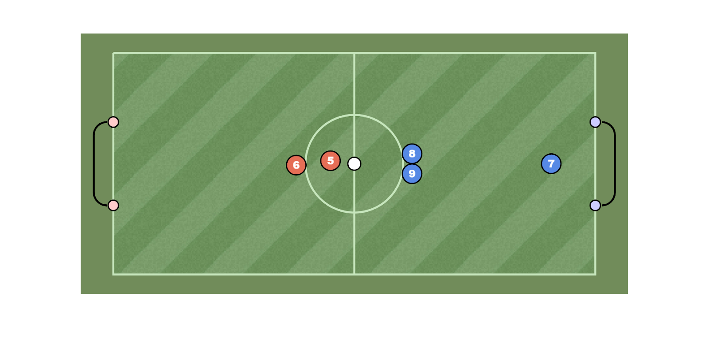

Playing (after ball is touched):  
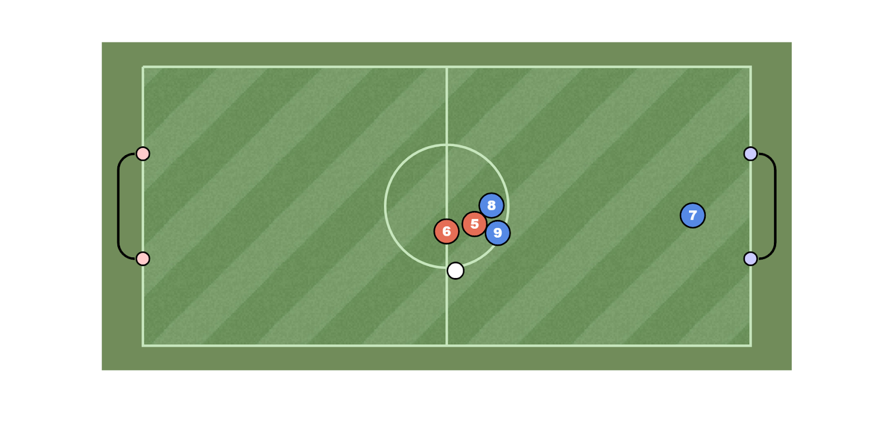

- **Actions:** Each player can move in a cardinal direction and output a binary kick command. A `MultiDiscrete` space maps X-movement to $(-1, 0, 1)$, Y-movement to $(-1, 0, 1)$, and Kick to $(0, 1)$

Movement Actions:  
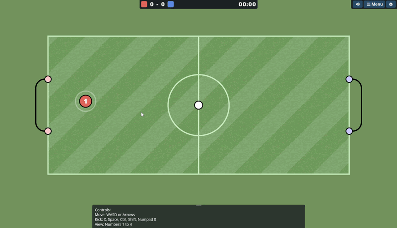

Kick Action:  
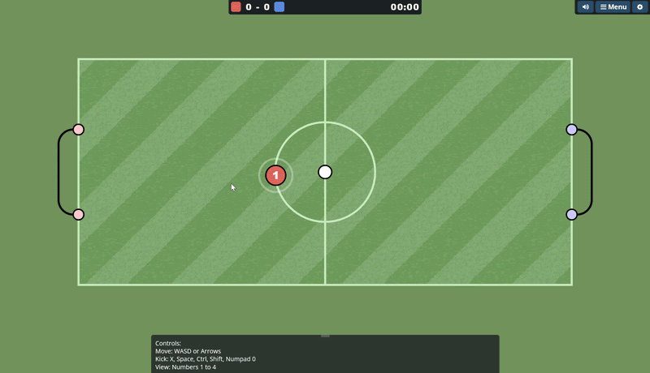

### Reward Function

We originally use a reward function with the following:

- Step Penalty: $-0.01$
- Goal Scored / Conceded: $+100$ / $-100$
- Ball Velocity to Goal: $+0.05$
- Align Ball to Goal $+0.5$

Step Penalty is to encourage urgency. The Goal Scored and Goal Conceded are the primary objectives. Ball Velocity to Goal rewards when the ball is heading towards the opponent’s goal. Align Ball to Goal uses cosine similarity reward when the agent is behind the ball in line with the opponent’s goal.

### Classical Bots

To evaluate our models and provide opponents for training, we use the classical heuristic bots:

- **RandomBot:** Executes uniformly random actions.
- **StrikerBot:** Moves to a target point behind the ball in line with the opposing goal and kicks if close to the target point.
- **GoalkeeperBot:** Stays near the team’s goal between the ball and goal.
- **AllRounderBot:** Switches between attacking, defending, and passing based on player proximity and ball location.

Here is some gameplay footage of the classical bots:

StrikerBot vs RandomBot:  
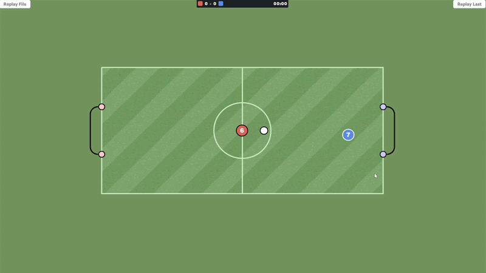

2 StrikerBot vs 2 GoalkeeperBot:  
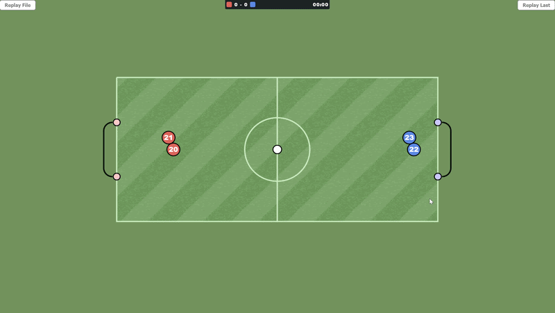

2 StrikerBot + 1 GoalkeeperBot vs 3 AllRounderBot:  
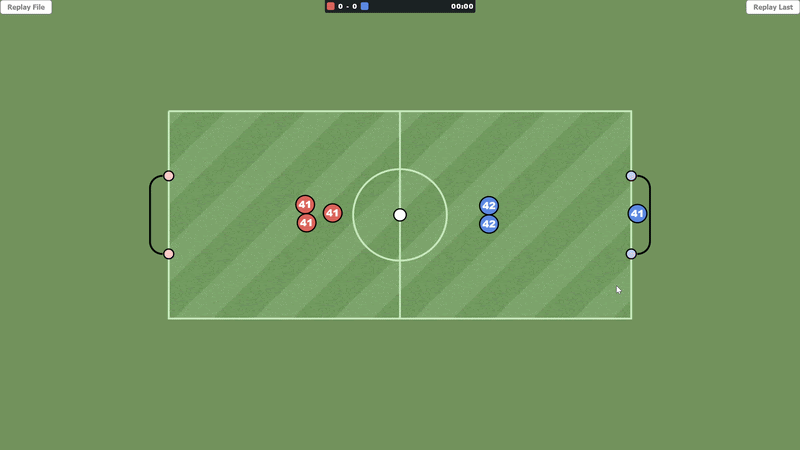

### Curriculum Training

Our training process involved training a single model across two drills, then in self-play in 1v1 and 2v2.

- **StrikerDrill:** The ball is placed randomly and the agent is placed behind the ball. This teaches the agent to score over 1,000,000 timesteps.
- **GoalkeeperDrill:** The ball’s velocity is set toward the goal and the agent is placed near its path. This teaches the agent to defend over 1,000,000 timesteps.
- **1v1 Self-Play:** The agent plays against itself for 2,000,000 timesteps.
- **2v2 Self-Play:** The agent plays in a team against itself in a team for 4,000,000 timesteps.

Striker Drill:  
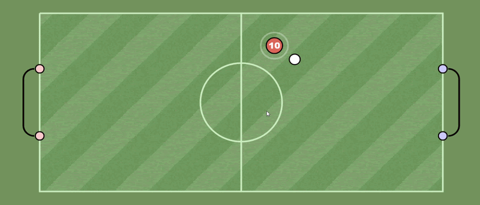

Goalkeeper Drill:  
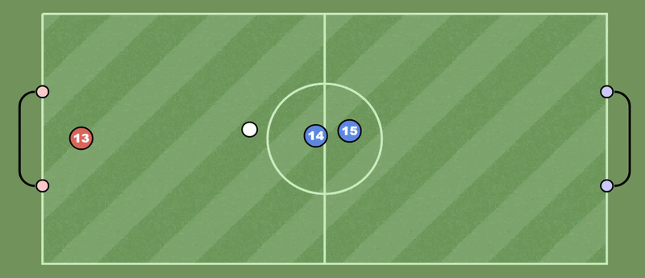

### Hyperparameter Optimization

We tuned the learning rate, batch size, and entropy coefficient using Optuna over 10 trials of 500,000 timesteps in a 1v1 scenario against a GoalkeeperBot. We used the PPO default for other hyperparameters.

Hyperparameter Importance:  
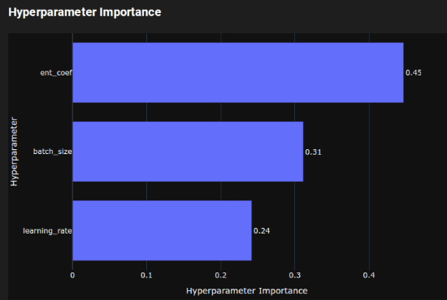

Best Trial:  
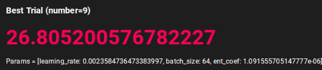

## Evaluation

### Training Results

To track learning progress, we measured the average episode reward via Tensorboard across our training curriculum.

Striker Drill Mean Episode Reward:  
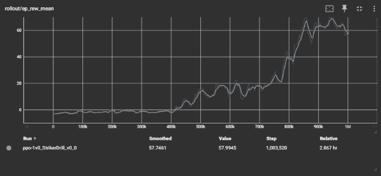

For the Striker Drill, the agent hovers around a mean episode reward of -2 until 400,000 timesteps. The mean episode reward then steadily climbs and converges to a reward of 58 at 1,000,000 timesteps. This shows the agent successfully learned to approach the ball and score approximately half the time.

Striker Drill after 200,000 timesteps:  
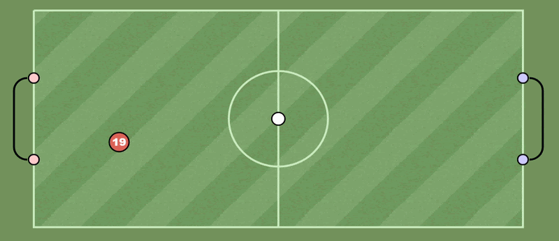

Striker Drill after 1,000,000 timesteps:  
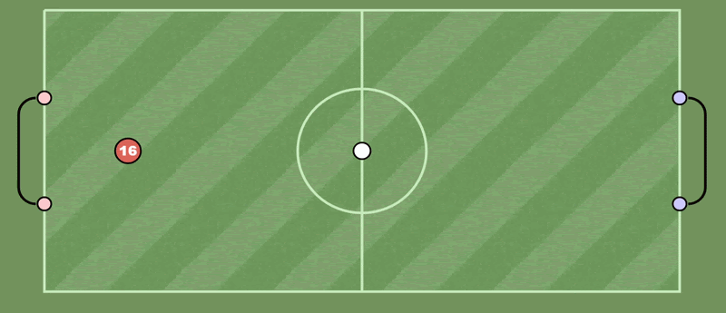

Striker Drill and Goalkeeper Drill Mean Episode Reward:  
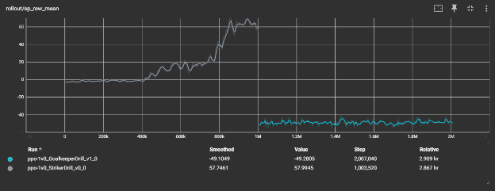

For the Goalkeeper Drill, the mean episode reward stagnated around -50, indicating the agent was able to block around half the shots.

1v1 and 2v2 Self-Play Mean Episode Reward:  
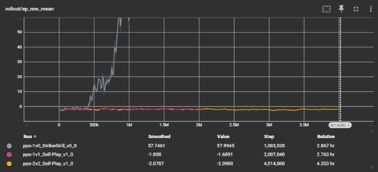

In 1v1 and 2v2 self-play, the mean episode reward hovered near -2, reflecting the zero-sum nature of self-play.

### Tournament

To measure objective skill, we used the `openskill` library to implement a Plackett-Luce rating model. We hosted a singles round-robin tournament of 10,000 timestep matches to evaluate our trained models against the classical bots.

Tournament Results:

- GoalkeeperBot: 8.68
- StrikerBot: 7.43
- ppo-StrikerDrill: 6.71
- AllRounderBot: 5.08
- RandomBot: -0.35

The Goalkeeper and Striker bots performed the best, our PPO agent was third best, and the RandomBot performed the worst.

Tournament Results:  
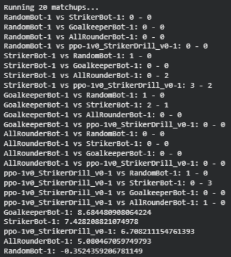

### Replays

We recorded and viewed replays of games to identify learned behaviors. Visual analysis was crucial for refining the reward function and training curriculum.

Reward Hacking Example:  
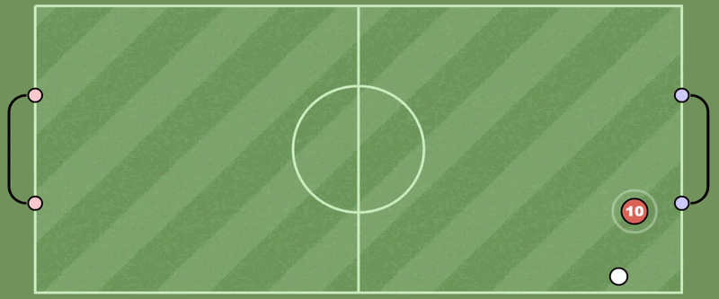
The agent moving back and forth in front of the ball was one example of reward hacking behavior that we found when we rewarded absolute agent alignment for each timestep instead of rewarding improvement in alignment.

Unlearning Example:  
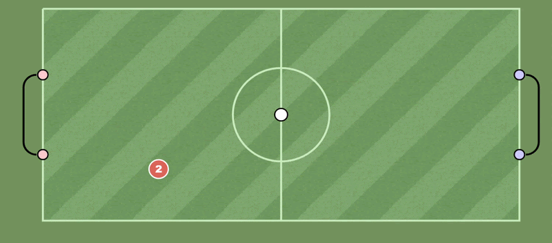

This example shows the agent unlearning how to score from the Striker Drill after training on the Goalkeeper drill.

## Resources

### Libraries and Frameworks

- [Haxball](https://www.haxball.com/): Physics-based multiplayer soccer game the project is based around.
- [Ursinaxball](https://github.com/spicecat/Ursinaxball): The physics engine used to simulate Haxball.
- [HaxballGym](https://github.com/spicecat/HaxballGym): The Gymnasium environment for Ursinaxball.
- [Stable-Baselines3](https://github.com/DLR-RM/stable-baselines3): Used for PPO algorithm implementation.
- [PettingZoo](https://github.com/Farama-Foundation/PettingZoo): Used for Multi-agent environment implementation.
- [SuperSuit](https://github.com/Farama-Foundation/SuperSuit): Wrapper to vectorize Gymnasium environments for PettingZoo’s multi-agent context.
- [Optuna](https://optuna.org/): Used for automated hyperparameter optimization.
- [OpenSkill](https://openskill.me/): Used to calculate TrueSkill ratings for evaluation tournaments.
- [Tensorboard](https://www.tensorflow.org/tensorboard): Used to visualize training metrics.
- [PyDrive2](https://github.com/iterative/PyDrive2): Used to save model checkpoints to Google Drive.

### References

- Schulman, J., et al. (2017). _Proximal Policy Optimization Algorithms_. OpenAI. ([Spinning Up Documentation](https://spinningup.openai.com/en/latest/algorithms/ppo.html))
- Stable-Baselines3 Documentation for default PPO hyperparameters: [SB3 PPO](https://stable-baselines3.readthedocs.io/en/master/modules/ppo.html#parameters)

### AI Tool Usage

- [Gemini 3](https://ai.google.dev/gemini-api/docs/gemini-3): Used for code assistance and to suggest configurations for reward functions and state setters.
